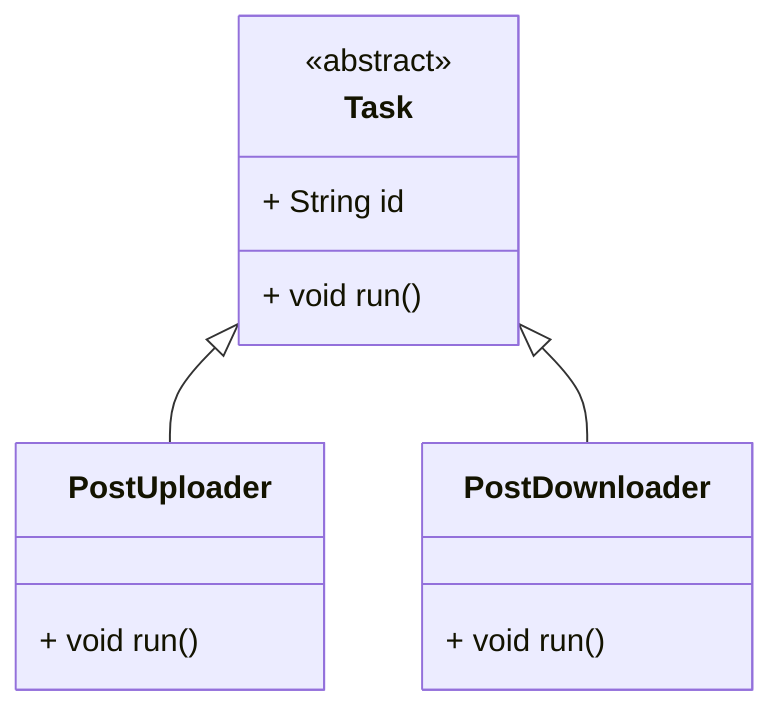

# Understanding Abstraction in OOP

### What is Abstraction?

**Abstraction** is the process of hiding the internal details and showing only the important parts.

Think of it like using an app's “Download” button. You click it, and a post is downloaded. You don’t need to know **how
** the data is fetched, parsed, or stored — that’s all hidden from you.

In programming, abstraction helps you:

* Work with general actions, not specific implementations
* Focus on **what** an object does, not **how** it does it
* Write code that is flexible and reusable

---

### Real-World Example: Task Manager

In a photo-sharing app, you might have different tasks running in the background:

* Uploading posts
* Downloading posts
* Maybe even deleting posts in the future

Each of these tasks has its own steps, but to the **Task Manager**, they’re all just “tasks” that need to be started.

That’s abstraction in action — the manager doesn’t care **how** the task works, only that it has a `.run()` method.

---

## Abstraction in Dart: Using `Task`

Let’s define an **abstract class** `Task` that says every task must implement a `run()` method. Then we’ll create two
concrete tasks:

* `PostUploader` — Uploads a post
* `PostDownloader` — Downloads a post

---

### Class Diagram (Mermaid)



---

### Dart Code Example

```dart
// Abstract class defining a task
abstract class Task {
  final String id;

  Task(this.id);

  void run(); // Must be implemented by all tasks
}

// Upload Task
class PostUploader extends Task {
  final String postData;

  PostUploader({required String id, required this.postData}) : super(id);

  @override
  void run() {
    print('Uploading post: $postData');
    // simulate upload...
  }
}

// Download Task
class PostDownloader extends Task {
  final String postId;

  PostDownloader({required String id, required this.postId}) : super(id);

  @override
  void run() {
    print('Downloading post with ID: $postId');
    // simulate download...
  }
}
```

---

### Example Usage

```dart
void main() {
  List<Task> tasks = [
    PostUploader(id: 't1', postData: 'New post content'),
    PostDownloader(id: 't2', postId: 'post123'),
  ];

  for (var task in tasks) {
    task.run(); // The Task Manager doesn't care what kind of task it is
  }
}
```

---

### What’s Happening?

* You define an **abstract class** `Task` with a method `run()`
* Each task (Uploader or Downloader) provides its own implementation of `run()`
* Your `Task Manager` just calls `run()` — it doesn’t need to know which specific task it is

That’s abstraction: working with a general interface without knowing the internal details.

---

### What You Learned

* **Abstraction** hides complex logic and shows only what’s needed
* Abstract classes define a **common interface** for related things
* You can use abstraction to design scalable systems like a Task Manager

---

Would you like updated self-test problems based on this Task abstraction model?
