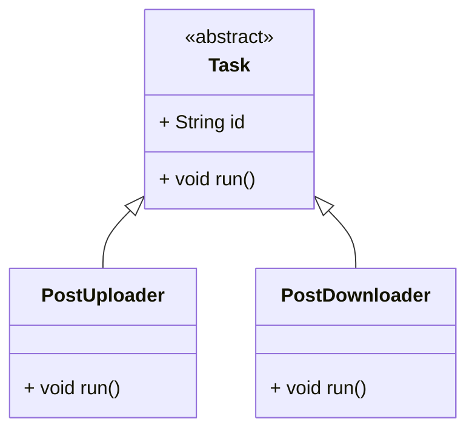

# OOP-এ অ্যাবস্ট্রাকশন (Abstraction)

### অ্যাবস্ট্রাকশন কী?

**অ্যাবস্ট্রাকশন** মানে হলো ভিতরের জটিলতা লুকিয়ে রাখা আর শুধু দরকারি অংশটাই সামনে দেখানো।

একটু ভাবুন, আপনি একটা অ্যাপের “Download” বাটনে ক্লিক করছেন। ক্লিক করলেই পোস্ট ডাউনলোড হয়ে যায়। কিন্তু আপনি জানেন না বা জানার দরকারও পড়ে না **কিভাবে** সেই ডেটা নিয়ে আসা হচ্ছে, প্রসেস করা হচ্ছে বা কোথায় রাখা হচ্ছে — এগুলো সব ব্যাকএন্ডে ঘটে যাচ্ছে, আপনার চোখের আড়ালে।

প্রোগ্রামিং-এ অ্যাবস্ট্রাকশন আমাদের যেগুলোতে সাহায্য করে:

* আমরা জেনেরাল কাজ নিয়ে কাজ করতে পারি, ডিটেইল ইমপ্লিমেন্টেশন না জেনেও
* আমরা ফোকাস করতে পারি **কী করে** সেটা নয়, বরং **কি করে** সেটা
* এমন কোড লিখতে পারি যেটা রিইউজ করা যায়, ফ্লেক্সিবল থাকে

---

### বাস্তব উদাহরণ: টাস্ক ম্যানেজার

ধরুন আপনি একটা ফটো-শেয়ারিং অ্যাপ বানাচ্ছেন। এই অ্যাপে ব্যাকগ্রাউন্ডে অনেকগুলো কাজ একসাথে চলতে পারে:

* পোস্ট আপলোড হচ্ছে
* পোস্ট ডাউনলোড হচ্ছে
* ভবিষ্যতে হয়তো পোস্ট ডিলিটও করা লাগবে

প্রত্যেকটা কাজের নিজের নিজস্ব ধাপ আছে। কিন্তু **Task Manager**-এর কাছে এরা সবই “টাস্ক” — যেগুলো চালু করতে হয়।

এটাই হলো অ্যাবস্ট্রাকশন — ম্যানেজার জানে না **কীভাবে** একটা টাস্ক কাজ করে, শুধু জানে ওটা `.run()` করে চালু হয়।

---

## Dart-এ অ্যাবস্ট্রাকশন: `Task` ব্যবহার করে

চলুন আমরা একটা **abstract class** `Task` বানাই — যেটা বলে দেয়, প্রতিটা টাস্ক-এ `run()` মেথড থাকতে হবে।

তারপর আমরা দুইটা ক্লাস বানাবো:

* `PostUploader` — পোস্ট আপলোড করে
* `PostDownloader` — পোস্ট ডাউনলোড করে

---

### ক্লাস ডায়াগ্রাম (Mermaid)



---

### Dart কোড উদাহরণ

```dart
// টাস্ক সংজ্ঞায়িত করা অ্যাবস্ট্রাক্ট ক্লাস
abstract class Task {
  final String id;

  Task(this.id);

  void run(); // সব টাস্ক-এ এইটা লাগবেই
}

// আপলোড টাস্ক
class PostUploader extends Task {
  final String postData;

  PostUploader({required String id, required this.postData}) : super(id);

  @override
  void run() {
    print('Uploading post: $postData');
    // আপলোড সিমুলেট করছি...
  }
}

// ডাউনলোড টাস্ক
class PostDownloader extends Task {
  final String postId;

  PostDownloader({required String id, required this.postId}) : super(id);

  @override
  void run() {
    print('Downloading post with ID: $postId');
    // ডাউনলোড সিমুলেট করছি...
  }
}
```

---

### ব্যবহার কেমন হতে পারে

```dart
void main() {
  List<Task> tasks = [
    PostUploader(id: 't1', postData: 'New post content'),
    PostDownloader(id: 't2', postId: 'post123'),
  ];

  for (var task in tasks) {
    task.run(); // Task Manager-এর মাথাব্যথা নেই টাস্কটা কিসের
  }
}
```

---

### এখানে কী ঘটছে?

* আপনি একটা **abstract class** বানালেন — `Task`, যেটার মধ্যে `run()` আছে
* প্রত্যেকটা টাস্ক (Uploader বা Downloader) তাদের নিজেদের মতো করে `run()` এর ইমপ্লিমেন্টেশন দেয়
* আপনার `Task Manager` শুধু `.run()` কল করে — তার জানার দরকার নেই ভিতরে আসলে কী টাস্ক চলছে

এটাই হলো অ্যাবস্ট্রাকশন — একটা কমন ইন্টারফেস দিয়ে কাজ চালানো, ভিতরের জটিলতা না জেনেও।

---

### আপনি যা শিখলেন

* **অ্যাবস্ট্রাকশন** কমপ্লেক্স জিনিসগুলো লুকিয়ে রাখে, শুধু দরকারি জিনিস দেখায়
* Abstract ক্লাস দিয়ে আপনি একই ধরণের জিনিসের জন্য **কমন ইন্টারফেস** বানাতে পারেন
* বড় স্কেল-এ সিস্টেম ডিজাইন করতে গেলে অ্যাবস্ট্রাকশন অনেক হেল্প করে — যেমন Task Manager

