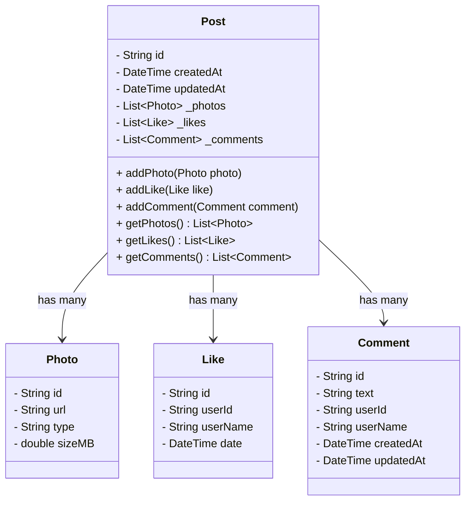

---

# রিয়েল ডেভেলপমেন্টে এনক্যাপসুলেশন

---

#### আপনি যা শিখবেন

* কখন একটা ক্লাস তৈরি করা দরকার

* কীভাবে বুঝবেন কোন দায়িত্বটা কোন ক্লাসের

* কীভাবে এনক্যাপসুলেশন ক্লাসের ভিতরের কাজগুলো লুকিয়ে রাখে আর ডেটা প্রোটেক্ট করে

* রিয়েল লাইফ ডেভেলপমেন্টের একটা উদাহরণ, যেখানে একটা ক্লাস নিজের প্রপার্টিগুলো প্রাইভেট রাখে এবং বাইরের অংশকে সেফ মেথড দিয়ে অ্যাক্সেস করতে দেয়

---

### কখন ক্লাস বানানো উচিত সেটা বুঝে নেওয়া

এনক্যাপসুলেশন নিয়ে কথা বলার আগে, আগে বুঝে নিই — **কেন এবং কখন ক্লাস তৈরি করা উচিত**।

**ক্লাস** হচ্ছে এমন একটা নীল-নকশা, যেটা আপনাকে একসাথে সম্পর্কিত ডেটা আর সেই ডেটার উপর কাজ করে এমন ফাংশনগুলো একজায়গায় রাখতে সাহায্য করে।

নীচে কিছু সিচুয়েশন দেয়া হলো, যেগুলো ইঙ্গিত করে আপনি ক্লাস বানাবেন:

| পরিস্থিতি                                | এর মানে কী                                                                         |
| ---------------------------------------- | ---------------------------------------------------------------------------------- |
| একাধিক রিলেটেড ভ্যালু আছে                | যেমন, একটা কমেন্টে থাকে টেক্সট, ইউজার ইনফো আর টাইম — এগুলো একসাথে ক্লাসে রাখা যায় |
| বারবার একই কিছু প্যারামিটার পাঠাতে হচ্ছে | ধরুন, আপনি বারবার photo ID, URL, আর size পাঠাচ্ছেন — এগুলো একসাথে একটা ক্লাসে দিন  |
| ডেটা কিছু বাস্তব জিনিস বোঝাচ্ছে          | Post, comment, like, বা photo — এগুলো সব অ্যাপের রিয়েল ফিচার                      |
| ডেটার সাথে কাজ করতে চান                  | যদি পোস্টে `like()` বা `comment()` মেথড দরকার হয়, সেটা ক্লাসেই রাখা উচিত          |
| ডেটা কন্ট্রোল আর প্রটেক্ট করতে চান       | বাইরের কোড থেকে ডেটা পরিবর্তন নিয়ন্ত্রণে রাখতে ক্লাস ব্যবহার করুন                 |

---

### একটা ক্লাসের দায়িত্ব ঠিক করা

একটা ভালো ক্লাস **একটাই কাজ** করবে।

* `Photo` ক্লাস শুধু ফটো সম্পর্কিত তথ্য সামলাবে
* `Post` ক্লাস সামলাবে পোস্টের কাজকর্ম (যেমন: লাইকের সংখ্যা বাড়ানো, কমেন্ট অ্যাড করা)
* `Like` বা `Comment` ক্লাস শুধু ইউজারের ইন্টারঅ্যাকশন সংরক্ষণ করবে

সবকিছু এক ক্লাসে গুঁজে ফেলবেন না। ছোট ছোট দায়িত্ব আলাদা করে রাখলে কোড বোঝা আর মেইনটেইন করা অনেক সহজ হয়।

---

## এনক্যাপসুলেশন কী?

**Encapsulation** মানে হলো, ক্লাসের ভিতরের জিনিসপত্র লুকিয়ে রাখা, আর শুধু দরকারি জিনিসগুলা বাইরের দুনিয়ায় দেখানো।

যেমন:

* ভিতরের ডেটা প্রাইভেট রাখা (যেমন: `_likes`, `_photos`)

* সেগুলোর সাথে ইন্টারঅ্যাক্ট করার জন্য পাবলিক মেথড রাখা (যেমন: `addLike()`, `getComments()`)

**কেন এটা দরকারি?**

* যত্রতত্র ডেটা চেঞ্জ হয়ে যাওয়া থেকে রক্ষা করে

* কোড পড়া আর আপডেট করা সহজ হয়

* কে কী করছে, সেটা পরিষ্কার করে

---

## রিয়েল লাইফ উদাহরণ: `Post` ক্লাস যেটা নিজের Photo, Like আর Comment গুলো এনক্যাপসুলেট করে

এখন আমরা একটা `Post` ক্লাস বানাবো যেটা:

* `Photo`, `Like`, আর `Comment`-এর লিস্ট রাখবে

* এই লিস্টগুলোকে প্রাইভেট রাখবে

* বাইরের দিক থেকে সেফভাবে এক্সেস করার মেথড দেবে

---

### ক্লাস ডায়াগ্রাম



---

### Dart কোড উদাহরণ

```dart
class Photo {
  final String id;
  final String url;
  final String type;
  final double sizeMB;

  Photo({
    required this.id,
    required this.url,
    required this.type,
    required this.sizeMB,
  });
}

class Like {
  final String id;
  final String userId;
  final String userName;
  final DateTime date;

  Like({
    required this.id,
    required this.userId,
    required this.userName,
  }) : date = DateTime.now();
}

class Comment {
  final String id;
  final String text;
  final String userId;
  final String userName;
  final DateTime createdAt;
  DateTime updatedAt;

  Comment({
    required this.id,
    required this.text,
    required this.userId,
    required this.userName,
  })
      : createdAt = DateTime.now(),
        updatedAt = DateTime.now();
}

class Post {
  final String id;
  final DateTime createdAt;
  DateTime updatedAt;

  final List<Photo> _photos = [];
  final List<Like> _likes = [];
  final List<Comment> _comments = [];

  Post({required this.id})
      : createdAt = DateTime.now(),
        updatedAt = DateTime.now();

  void addPhoto(Photo photo) {
    _photos.add(photo);
    updatedAt = DateTime.now();
  }

  void addLike(Like like) {
    _likes.add(like);
    updatedAt = DateTime.now();
  }

  void addComment(Comment comment) {
    _comments.add(comment);
    updatedAt = DateTime.now();
  }

  List<Photo> getPhotos() => List.unmodifiable(_photos);

  List<Like> getLikes() => List.unmodifiable(_likes);

  List<Comment> getComments() => List.unmodifiable(_comments);
}
```

---

### ব্যবহার উদাহরণ

```dart
void main() {
  var post = Post(id: 'post001');

  post.addPhoto(Photo(
    id: 'ph1',
    url: 'https://cdn.app/img.jpg',
    type: 'jpeg',
    sizeMB: 2.5,
  ));

  post.addLike(Like(
    id: 'like001',
    userId: 'user123',
    userName: 'Alice',
  ));

  post.addComment(Comment(
    id: 'cmt001',
    text: 'Amazing photo!',
    userId: 'user456',
    userName: 'Bob',
  ));

  print('Photos in post: ${post.getPhotos().length}');
  print('Likes on post: ${post.getLikes().length}');
  print('Comments on post: ${post.getComments().length}');
}
```

---

### আপনি কী শিখলেন

* যখন আপনি সম্পর্কিত ডেটা আর ফাংশন একসাথে রাখতে চান, তখন ক্লাস তৈরি করা উচিত

* প্রতিটা ক্লাসের একটা নির্দিষ্ট কাজ থাকা উচিত

* এনক্যাপসুলেশন আপনার ক্লাসের ভিতরের ডেটা লুকিয়ে রাখে এবং সেফভাবে ব্যবহার করতে দেয়

* আপনি মেথড দিয়ে কন্ট্রোল করতে পারেন, কীভাবে বাইরের দিক থেকে ক্লাস ব্যবহার করা যাবে

---

## সেলফ-টেস্ট প্রবলেম ১: `User` ক্লাস (Encapsulation সহ)

**প্রব্লেম:**
একটা `User` ক্লাস বানান, যেটা ইউজারের `id`, `username`, আর `email` রাখবে। সব ফিল্ড প্রাইভেট হবে। পাবলিক গেটার থাকবে পড়ার জন্য। আর একটা `updateEmail(String newEmail)` মেথড থাকবে, যেটা ইমেইল আপডেট করতে দিবে।

**রুলস:**

* প্রাইভেট ফিল্ড ব্যবহার করুন (যেমন: `_id`)

* প্রতিটা ফিল্ডের জন্য পাবলিক গেটার দিন

* শুধু ইমেইল আপডেট করার জন্য একটা মেথড দিন

**হিন্ট:**
`String get id => _id;` — এইভাবে প্রাইভেট ফিল্ডকে এক্সপোজ করুন।

---

## সেলফ-টেস্ট প্রবলেম ২: `Album` ক্লাস (Photo লিস্ট এনক্যাপসুলেট করে)

**প্রব্লেম:**
একটা `Album` ক্লাস তৈরি করুন, যেটা `Photo` অবজেক্টের একটা লিস্ট রাখবে (আগের উদাহরণ থেকে)। `_photos` লিস্টটা প্রাইভেট হবে। `addPhoto()` আর `getPhotos()` মেথড থাকবে।

**রুলস:**

* আগের `Photo` ক্লাস ব্যবহার করুন

* `_photos` লিস্ট প্রাইভেট রাখুন

* `addPhoto()` আর `getPhotos()` এক্সপোজ করুন

**হিন্ট:**
`List.unmodifiable(_photos)` রিটার্ন করুন যেন বাইরে থেকে কেউ লিস্ট পাল্টাতে না পারে।

---

## সেলফ-টেস্ট প্রবলেম ৩: Like টগল করা এনক্যাপসুলেট করুন

**প্রব্লেম:**
`Photo` ক্লাস আপডেট করুন যেন **like toggle** করা যায়। একজন ইউজার লাইক না করলে লাইক করবে, আর আগে লাইক করে থাকলে সেটা আনলাইক করবে।

**রুলস:**

* `like(String userId)` মেথড আপডেট করুন যেন সেটা টগল করে

* নিশ্চিত করুন, একজন ইউজার একবারের বেশি লাইক না করতে পারে

**হিন্ট:**
চেক করুন `_likes` লিস্টে ওই `userId`-র কোনো `Like` অবজেক্ট আগেই আছে কিনা। থাকলে রিমুভ করুন, না থাকলে অ্যাড করুন।
