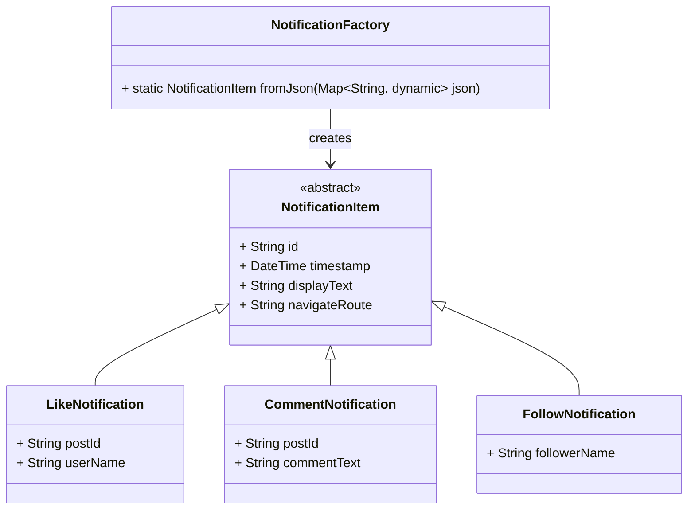

# ইনহেরিটেন্স

### একটা স্কেলেবল নোটিফিকেশন সিস্টেম তৈরি করা

---

## আপনি কী শিখবেন

* ইনহেরিটেন্স দিয়ে কীভাবে বিভিন্ন রকম নোটিফিকেশন মডেল করা যায়
* কীভাবে আপনার কোডকে এক্সটেনসিবল রাখা যায় Open/Closed Principle ব্যবহার করে
* API থেকে ডেটা এনে Dart-এ ফ্যাক্টরি কনস্ট্রাক্টরের মাধ্যমে কীভাবে হ্যান্ডেল করতে হয়
* একটা রিয়েল-ওয়ার্ল্ড ডিজাইন প্যাটার্ন যেটা Flutter-এর সাথে ভালো চলে, প্রোডাকশনে ইউজ করা যায়

---

## ইনহেরিটেন্স কেন দরকার?

Object-Oriented Programming-এর সবচেয়ে গুরুত্বপূর্ণ কনসেপ্টগুলোর একটা হলো ইনহেরিটেন্স। এটা দিয়ে আপনি:

* কমন বিহেভিয়ার গুলো একটা বেস ক্লাসে রাখতে পারেন
* স্পেসিফিক বিহেভিয়ার আলাদা চাইল্ড ক্লাসে রাখতে পারেন
* আপনার সিস্টেমকে সহজে বড় করা যায় এবং মেইনটেইন করাও সহজ হয়

**উদাহরণ**: ধরুন আপনি একটা সোশ্যাল মিডিয়া অ্যাপ বানাচ্ছেন। ওখানে একটা নোটিফিকেশন সিস্টেম থাকবে, যেটা হ্যান্ডেল করবে অনেক
রকম টাইপ:

* Like
* Comment
* Follow
* Mention
* কাউকে ট্যাগ করা হয়েছে কোনো ছবিতে

এই সবগুলোই নোটিফিকেশন হলেও, প্রত্যেকটার নিজস্ব ডেটা আর বিহেভিয়ার আছে। সেগুলোকে আমরা সুন্দরভাবে মডেল করতে পারি **একটা বেস
ক্লাস আর একাধিক চাইল্ড ক্লাস** দিয়ে।

---

## বাস্তব সমস্যা

আপনি একটা সোশ্যাল মিডিয়া অ্যাপ বানাচ্ছেন যেখানে একটা **নোটিফিকেশন স্ক্রিন** থাকবে। ইউজারদের জন্য নোটিফিকেশনগুলো API থেকে
আসে JSON ফরম্যাটে, যেমন:

```json
{
  "type": "like",
  "id": "n1",
  "timestamp": "2025-05-17T10:00:00Z",
  "postId": "p1",
  "userName": "Alice"
}
```

বা

```json
{
  "type": "follow",
  "id": "n2",
  "timestamp": "2025-05-17T11:00:00Z",
  "followerName": "Bob"
}
```

আপনার অ্যাপের দরকার:

* এই জেসনগুলোকে Dart অবজেক্টে কনভার্ট করা
* প্রতিটা টাইপ অনুযায়ী আলাদা UI দেখানো
* টাইপ অনুযায়ী ভিন্ন ভিন্ন রাউটে যাওয়ার ব্যবস্থা করা

এই সব যদি আমরা `if` / `else` দিয়ে করি, তাহলে কোড জটিল আর বড় হয়ে যাবে। তারচেয়ে চলুন **Inheritance + Factory Pattern**
ব্যবহার করি।

---

## ক্লাস ডায়াগ্রাম (Mermaid)



---

## ধাপে ধাপে Dart কোড

---

### ১. বেস অ্যাবস্ট্র্যাক্ট ক্লাস ডিফাইন করা

```dart
abstract class NotificationItem {
  final String id;
  final DateTime timestamp;

  NotificationItem({
    required this.id,
    required this.timestamp,
  });

  String get displayText;

  String get navigateRoute;
}
```

এই ক্লাস:

* **abstract**, মানে সরাসরি `NotificationItem` অবজেক্ট তৈরি করা যাবে না
* কমন প্রপার্টি ধরে যেমন `id` আর `timestamp`
* চাইল্ড ক্লাসগুলোকে বাধ্য করে `displayText` আর `navigateRoute` দিতে

---

### ২. প্রতিটা নোটিফিকেশনের জন্য আলাদা সাবক্লাস তৈরি করা

#### LikeNotification

```dart
class LikeNotification extends NotificationItem {
  final String postId;
  final String userName;

  LikeNotification({
    required String id,
    required DateTime timestamp,
    required this.postId,
    required this.userName,
  }) : super(id: id, timestamp: timestamp);

  @override
  String get displayText => "$userName আপনার পোস্টে লাইক দিয়েছে";

  @override
  String get navigateRoute => "/post/$postId";
}
```

#### CommentNotification

```dart
class CommentNotification extends NotificationItem {
  final String postId;
  final String commentText;

  CommentNotification({
    required String id,
    required DateTime timestamp,
    required this.postId,
    required this.commentText,
  }) : super(id: id, timestamp: timestamp);

  @override
  String get displayText => "আপনার পোস্টে নতুন কমেন্ট: \"$commentText\"";

  @override
  String get navigateRoute => "/post/$postId/comments";
}
```

#### FollowNotification

```dart
class FollowNotification extends NotificationItem {
  final String followerName;

  FollowNotification({
    required String id,
    required DateTime timestamp,
    required this.followerName,
  }) : super(id: id, timestamp: timestamp);

  @override
  String get displayText => "$followerName আপনাকে ফলো করছে";

  @override
  String get navigateRoute => "/user/$followerName";
}
```

---

### ৩. JSON থেকে ডেটা পার্স করার জন্য একটা Factory ক্লাস তৈরি করা

`fromJson` যদি বেস ক্লাসের ভেতরে রাখি, তাহলে সেটা **Open/Closed Principle** ভাঙবে। তাই আলাদা ফ্যাক্টরি ক্লাস বানাচ্ছি।

```dart
class NotificationFactory {
  static NotificationItem fromJson(Map<String, dynamic> json) {
    final String type = json['type'];
    final String id = json['id'];
    final DateTime timestamp = DateTime.parse(json['timestamp']);

    switch (type) {
      case 'like':
        return LikeNotification(
          id: id,
          timestamp: timestamp,
          postId: json['postId'],
          userName: json['userName'],
        );
      case 'comment':
        return CommentNotification(
          id: id,
          timestamp: timestamp,
          postId: json['postId'],
          commentText: json['comment'],
        );
      case 'follow':
        return FollowNotification(
          id: id,
          timestamp: timestamp,
          followerName: json['followerName'],
        );
      default:
        throw UnimplementedError("অজানা নোটিফিকেশন টাইপ: $type");
    }
  }
}
```

এভাবে আপনি সহজে নতুন টাইপের নোটিফিকেশন যোগ করতে পারবেন, আগের কোডে হাত না দিয়েই।

---

এই অংশে ব্যাখ্যা করছি কেন Inheritance + Factory মডেল ব্যবহার করাটা ট্র্যাডিশনাল মেথডের থেকে অনেক ভালো।

---

## ট্র্যাডিশনাল মেথডের থেকে এটা ভালো কেন?

রিয়েল অ্যাপে, যেমন সোশ্যাল মিডিয়া প্ল্যাটফর্ম, নোটিফিকেশনের টাইপ খুব দ্রুত বাড়ে — লাইক, কমেন্ট, ফলো, ট্যাগ, মেনশন,
স্টোরি ভিউ ইত্যাদি।

ট্র্যাডিশনাল মেথডে হয়তো কোড এমন হয়:

```dart
void handleNotification(Map<String, dynamic> json) {
  String type = json['type'];

  if (type == 'like') {
    // লাইক হ্যান্ডেল করো
  } else if (type == 'comment') {
    // কমেন্ট হ্যান্ডেল করো
  } else if (type == 'follow') {
    // ফলো হ্যান্ডেল করো
  } else {
    // অজানা টাইপ
  }
}
```

দুই–তিনটা টাইপ থাকলে এটা ঠিক আছে। কিন্তু টাইপ বাড়তে থাকলে কোডটা একসময় বিশাল হয়ে যায়, আর মেইনটেইন করাও কষ্টকর।

---

### ট্র্যাডিশনাল মেথডের সমস্যা

| সমস্যা                         | ব্যাখ্যা                                          |
|--------------------------------|---------------------------------------------------|
| স্কেল করাই মুশকিল              | নতুন টাইপ যোগ মানে অনেক জায়গায় কোড আপডেট করতে হবে |
| Open/Closed Principle ভেঙে যায় | একই মেথড বারবার এডিট করতে হয়, এতে বাগ আসে         |
| রিপিট করা কোড                  | `id`, `timestamp` বারবার হ্যান্ডেল করা হয়         |
| টেস্ট করা কষ্টকর               | সব লজিক একসাথে থাকায় আলাদা করে টেস্ট করা কঠিন     |
| UI জটিল হয়ে যায়                | প্রতিটা টাইপ UI-তে আলাদা আলাদা হ্যান্ডেল করতে হয়  |

---

### OOP + Factory অ্যাপ্রোচে যা পাওয়া যায়

| ফিচার                               | সুবিধা                                              |
|-------------------------------------|-----------------------------------------------------|
| **Base Class** (`NotificationItem`) | শেয়ার্ড স্ট্রাকচার সেট করে, সব টাইপে কনসিসটেন্সি    |
| **Subclasses** (Like, Comment...)   | প্রতিটা টাইপের আলাদা লজিক আর ডেটা থাকে              |
| **Factory Class**                   | টাইপ অনুযায়ী অবজেক্ট তৈরি করে, বেস ক্লাস জটিল হয় না |
| **Open/Closed Principle**           | নতুন টাইপ যোগ করতে পুরনো কোড স্পর্শ করতে হয় না      |
| **UI ফ্রেন্ডলি**                    | এক জেনেরিক UI দিয়ে সব টাইপ রেন্ডার করা যায়          |
| **পরিচ্ছন্ন কোড**                   | সহজে টেস্ট, ডিবাগ, এক্সটেন্ড করা যায়                |

---

সংক্ষেপে বললে, এলোমেলো `if-else` দিয়ে কোড জটিল করার বদলে:

* ফ্যাক্টরিতে সব ক্রিয়েশন লজিক রাখুন
* সাবক্লাসে স্পেসিফিক বিহেভিয়ার রাখুন
* মেইন লজিককে পরিষ্কার আর পলিমরফিক রাখুন

এটা শুধু কোড কোয়ালিটির জন্য না — Flutter-এ প্রোডাকশন লেভেল অ্যাপে এটা একদম দরকারি।

---

## নিজে চেষ্টা করুন

১. একটা নতুন টাইপের নোটিফিকেশন যোগ করুন: `mention` (আপনাকে কেউ কোনো পোস্টে মেনশন করেছে)

