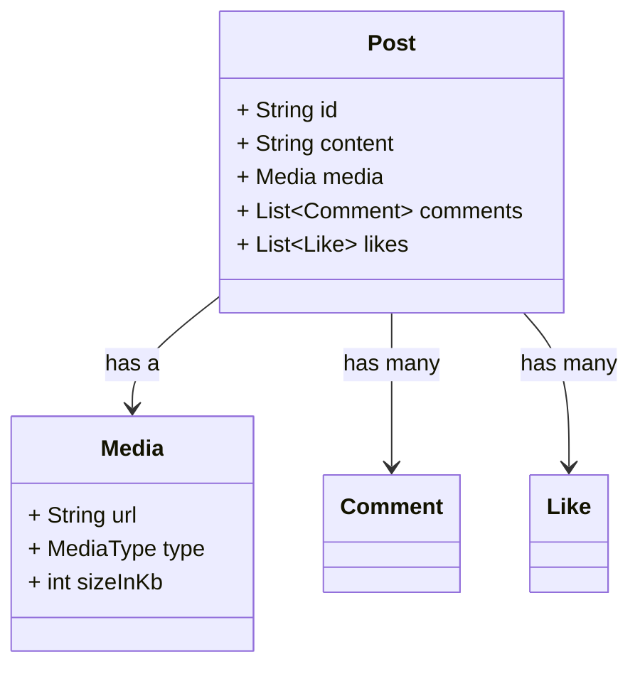

# Dart-এ Composition আর Inheritance – কখন কোনটা ইউজ করব?

## প্রথমে জানি, এদের মধ্যে আসলে পার্থক্যটা কী?

| বিষয়                | Inheritance                           | Composition                    |
| ------------------- | ---------------------------------------------------- | ------------------------------------------------ |
| সম্পর্ক             | “is a” – মানে একটা জিনিস আরেকটার টাইপ                | “has a” – মানে একটা জিনিসের মধ্যে আরেকটা আছে     |
| কিভাবে কাজ করে      | এক ক্লাস আরেকটা ক্লাসকে extend করে                   | এক ক্লাসের ভিতরে আরেকটা ক্লাসকে ফিল্ড হিসেবে রাখে |
| যোগসূত্র (coupling) | টাইট – উপরের ক্লাস বদলালে নিচের সব জায়গায় প্রভাব পড়ে | লুজ – সহজে কোনো একটা পার্ট পাল্টানো যায়          |
| flexibility         | খুব ডিপ হলে জিনিসটা rigid হয়ে যায়                    | অনেক বেশি flexible, ভাগ করে কাজ করা যায়          |

---

## সোশ্যাল মিডিয়া অ্যাপ দিয়ে একটা উদাহরণ দেখি

ধরেন আপনি একটা সোশ্যাল মিডিয়া অ্যাপ বানাচ্ছেন, যেখানে **Post** আর **Media** আছে।

### Inheritance ভুলভাবে ব্যবহার করলে কী সমস্যা?

অনেকে হয়তো এমন কিছু লিখে ফেলে:

```dart
class Post extends Photo {}
```

মানে দাঁড়ায়:

* `Post` আসলে একটা `Photo`
* প্রতিটা পোস্ট শুধু ছবি-ই হতে পারবে
* কিন্তু ভবিষ্যতে যদি ভিডিও, টেক্সট বা লিঙ্ক টাইপ পোস্ট করতে হয়?

তখনই সমস্যাটা ধরা পড়বে। এইভাবে করলে কোডটা flexible থাকে না, রিইউজও কঠিন হয়ে পড়ে।

---

### তার চেয়ে composition ইউজ করাটাই বেটার

আমরা একটা আলাদা `Media` ক্লাস বানিয়ে নিই। তারপর `Post` এর মধ্যে একটা `media` ফিল্ড রাখি।

এইভাবে করলে ভবিষ্যতে নতুন মিডিয়া টাইপ আসলেও কোনো সমস্যা হবে না।

---

## ক্লাস ডায়াগ্রাম (দেখতে কেমন হবে structure)



---

## Composition-এর বাস্তব উদাহরণ (Dart কোড)

```dart
enum MediaType { image, video, audio }

class Media {
  final String url;
  final MediaType type;
  final int sizeInKb;

  Media({required this.url, required this.type, required this.sizeInKb});
}

class Like {
  final String userId;
  final DateTime timestamp;

  Like(this.userId) : timestamp = DateTime.now();
}

class Comment {
  final String userId;
  final String text;
  final DateTime timestamp;

  Comment(this.userId, this.text) : timestamp = DateTime.now();
}

class Post {
  final String id;
  final String content;
  final Media media;
  final List<Like> _likes = [];
  final List<Comment> _comments = [];

  Post({required this.id, required this.content, required this.media});

  void like(String userId) => _likes.add(Like(userId));

  void comment(String userId, String text) => _comments.add(Comment(userId, text));

  List<Like> get likes => List.unmodifiable(_likes);
  List<Comment> get comments => List.unmodifiable(_comments);
}
```

---

## কেন composition এইখানে জিতেছে?

* `Post` এখন শুধু image-এ আটকে নেই — ভিডিও, অডিও, যেকোনো কিছু সাপোর্ট করা যাবে
* ধরুন পরে `MediaType.reel` আসে — `Post` ক্লাসে হাতই দিতে হবে না
* `Media` ক্লাসটা আলাদা করেও test বা use করা যাবে অন্য জায়গায়
* UI বানানোর সময়ও সুবিধা — media-এর জন্য একরকম widget, post content-এর জন্য আরেকটা

---

## তাহলে কবে Inheritance ব্যবহার করব?

Inheritance ইউজ করাটা ঠিক হবে যখন:

* আসলেই বোঝাতে চাইছেন, “X হলো Y” টাইপ সম্পর্ক
* আপনি parent ক্লাসের behavior override করে customize করতে চাইছেন
* সব child ক্লাস একই ধরনের behavior follow করে

---

## আর Composition?

Composition ইউজ করুন যদি:

* একটা ক্লাস আরেকটা ক্লাসকে “use” করে বা “own” করে
* আপনার কোডটা modular আর reusable হওয়া দরকার
* আপনি জটিল inheritance structure এ ঢুকতে চান না

---

## ছোট্ট করে মনে রাখার টিপস

| যদি আপনি বলতে পারেন... | তাহলে ব্যবহার করুন... |
| ---------------------- | --------------------- |
| “X is a Y”             | Inheritance           |
| “X has a Y”            | Composition           |

