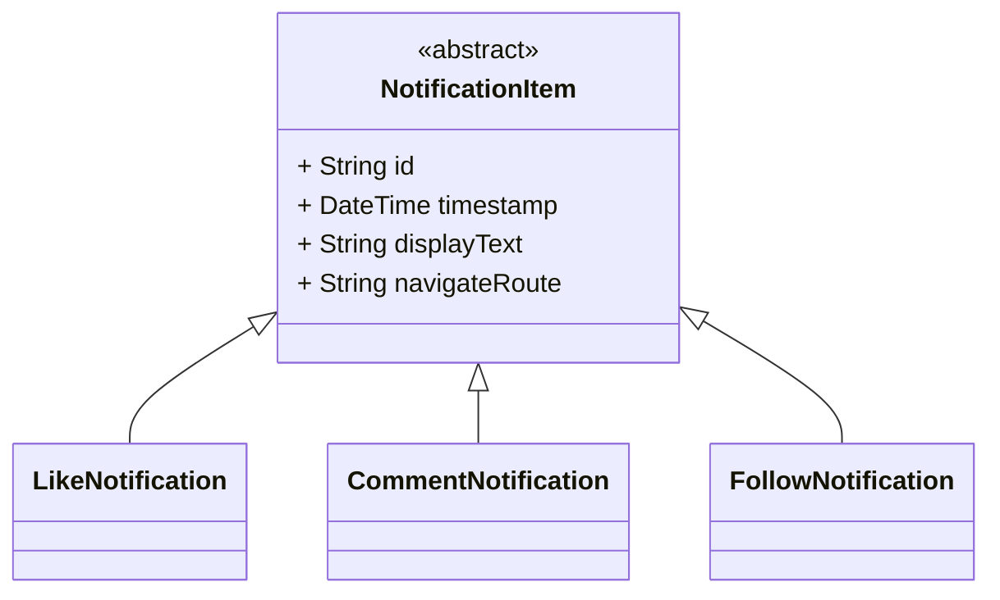

# Dart-এ পলিমরফিজম (একটা অ্যাপ উদাহরণ সহ)

---

## পলিমরফিজম মানে কী?

**Polymorphism** মানে হলো “একটার অনেক রূপ।” প্রোগ্রামিংয়ে এটা আমাদের এমন কোড লিখতে সাহায্য করে যা একাধিক টাইপের অবজেক্টের সাথে কাজ করতে পারে — যদি সেগুলোর একটা কমন সুপারক্লাস বা ইন্টারফেস থাকে।

এর ফলে আমরা পারি:

* আলাদা আলাদা সাবক্লাসকে এক টাইপ হিসেবে ট্রিট করতে
* নির্দিষ্ট টাইপ না জেনেও মেথড কল করতে
* বেশি ফ্লেক্সিবল আর এক্সটেনসিবল কোড লিখতে

---

### একটা সহজ উদাহরণ:

ধরুন `NotificationItem` হলো একটা “জেনেরিক টাইপ” — আর `LikeNotification`, `CommentNotification`, `FollowNotification` হলো “স্পেসিফিক টাইপ।”

এখন ধরুন আপনি জানেন না কোন টাইপ এসেছে, তাও আপনি `displayText` আর `navigateRoute` কল করতে পারবেন — কারণ সেগুলো বেস ক্লাসে ডিফাইন করা।

---

## বাস্তব অ্যাপের পরিস্থিতি: নোটিফিকেশন লিস্ট দেখানো

ধরুন আপনার অ্যাপের নোটিফিকেশন স্ক্রিনে অনেক রকম টাইপের নোটিফিকেশন আসে। এখন আপনি চাচ্ছেন না প্রতিটার জন্য আলাদা আলাদা `if-else` লিখে UI বানাতে। বরং আপনি একটা **লুপ চালিয়ে সবগুলোকে একসাথে রেন্ডার করতে** চাচ্ছেন।

এইখানেই Dart + Flutter-এ পলিমরফিজমের জাদু:

* UI কোড হয় ক্লিন আর ছোট
* মডেলগুলো ম্যানেজ করা সহজ হয়
* ভবিষ্যতে নতুন টাইপ যোগ করাও সহজ হয়

---

## ক্লাস ডায়াগ্রাম (আগের সেকশন থেকে রিভিউ)



---

## Dart কোড: পলিমরফিজম চলতে দেখুন

```dart
void renderNotificationScreen(List<NotificationItem> notifications) {
  for (var notification in notifications) {
    print(notification.displayText);     // সব টাইপের জন্য একই মেথড
    print('Go to: ${notification.navigateRoute}');
    print('---');
  }
}

void main() {
  final List<NotificationItem> notificationFeed = [
    LikeNotification("n1", DateTime.now(), "p1", "Alice"),
    CommentNotification("n2", DateTime.now(), "p2", "Nice!"),
    FollowNotification("n3", DateTime.now(), "u123", "Bob")
  ];

  renderNotificationScreen(notificationFeed);
}
```

এখানে `notificationFeed`-এ ৩টা আলাদা টাইপের অবজেক্ট থাকলেও আমরা একটাই লুপ দিয়ে কাজ চালিয়ে নিচ্ছি। এটাই হলো **পলিমরফিক কোড**।

---

## Dart-এ পলিমরফিজমের সুবিধা

| সুবিধা                 | ব্যাখ্যা                                                                   |
| ---------------------- | -------------------------------------------------------------------------- |
| কোড রিইউজ করা যায়      | একটা ফাংশনে অনেক রকম টাইপের অবজেক্ট হ্যান্ডেল করা যায়                      |
| Flutter UI হয় পরিষ্কার | সব নোটিফিকেশন টাইপ এক ইন্টারফেস দিয়েই উইজেট রেন্ডার করতে পারে              |
| মেইনটেইন করা সহজ       | নতুন টাইপ (যেমন `MentionNotification`) যোগ করতে পুরনো লজিকে হাত দিতে হয় না |
| এক্সটেনশনের জন্য ওপেন  | নতুন বিহেভিয়ার যোগ করতে গেলে পুরনো কোড বদলাতে হয় না                        |

---

## প্র্যাকটিস টাস্ক

নিজে চেষ্টা করে দেখুন:

* একটা নতুন `MentionNotification` ক্লাস বানান
* এটা যেন `NotificationItem` এক্সটেন্ড করে
* এর `displayText` আর `navigateRoute` ওভাররাইড করুন
* `"type": "mention"` এমন একটা JSON অবজেক্ট যোগ করুন
* ফ্যাক্টরি মেথডে এই নতুন টাইপ হ্যান্ডেল করুন
* `main()` ফাংশনে একটার মতো করে অ্যাড করে আউটপুট টেস্ট করুন

---
