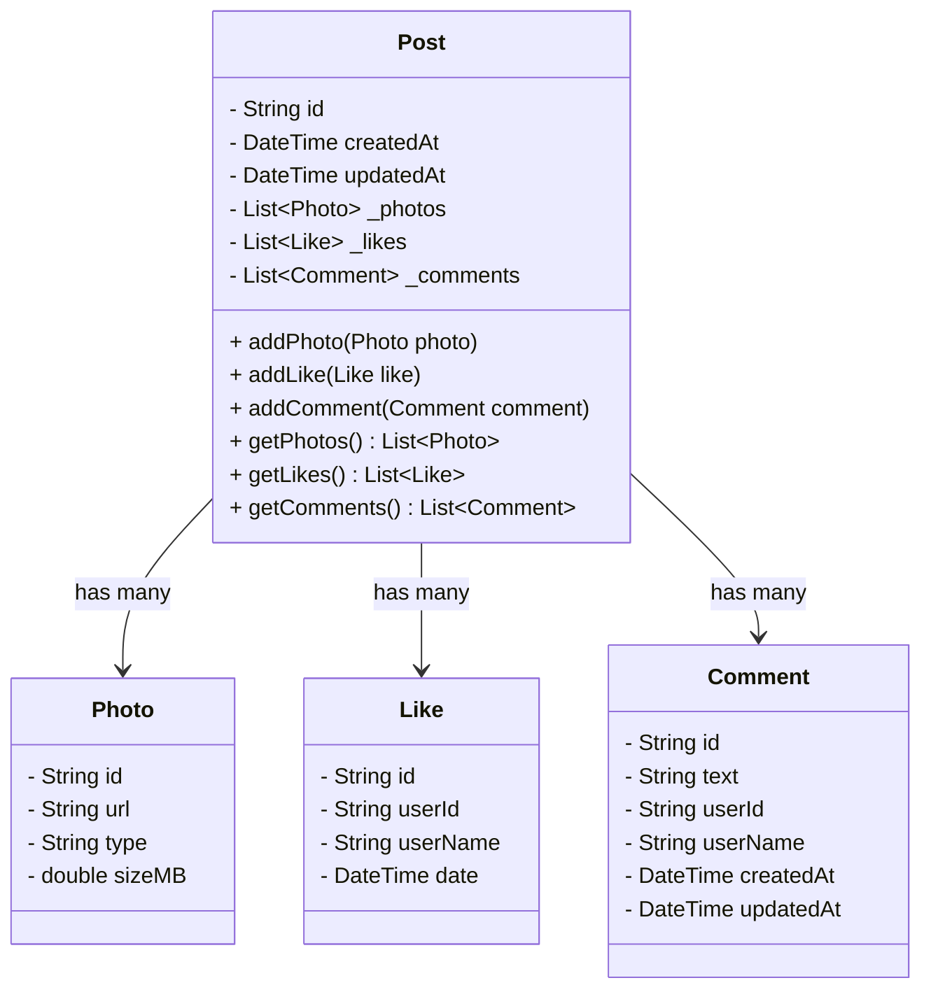

# Encapsulation

---

#### Learning Outcome

- When you should create a class.

- How to figure out and distribute responsibility of a class.

- How encapsulation helps hide the details of how the class works and protects its data.

- An real development world example on how a class keeps its attribute private and lets other parts of the app use safe
  methods to interact with them.

---

### Understanding When to Create a Class

Before we talk about encapsulation, let’s talk about **why and when we should create a class**.

A **class** is a blueprint that helps us group related data and the actions that work on that data.

Here are some signs you should create a class:

| Situation                                    | What It Means                                                                       |
|----------------------------------------------|-------------------------------------------------------------------------------------|
| You have several related values              | For example, a comment has text, user info, and a timestamp — these go together.    |
| You keep passing the same variables together | If you're always passing photo ID, URL, and size together, group them in one class. |
| The data represents something real           | A post, comment, like, or photo are all real features in your app.                  |
| You want to add actions with the data        | If a post needs a `like()` method or a `comment()` method, that belongs in a class. |
| You want to protect and manage changes       | Use classes to limit how data is changed from outside code.                         |

---

### Defining the Responsibility of a Class

A good class should do **one job only**.

- A `Photo` class should only handle photo information.

- A `Post` class should only handle post-related logic (like adding likes and comments).

- A `Like` or `Comment` should only store details about the interaction.

Don’t mix everything into one class. Keeping responsibilities small and focused makes the code easier to understand and
maintain.

---

## What is Encapsulation?

**Encapsulation** means hiding the internal parts of a class, and only exposing what’s needed.

For example:

- Keep internal data private (like `_likes` or `_photos`)

- Use public methods to safely interact with that data (like `addLike()` or `getComments()`)

**Why is this helpful?**

- Prevents bugs from uncontrolled changes

- Makes code easier to understand and update later

- Clearly separates responsibilities

---

## Real-World Example: Post with Encapsulated Photos, Likes, and Comments

Let’s now build a `Post` class that:

- Contains a list of `Photo`, `Like`, and `Comment`

- Keeps those lists private

- Provides safe methods to interact with them

---

### Class Diagram



---

### Dart Code Example

```dart
class Photo {
  final String id;
  final String url;
  final String type;
  final double sizeMB;

  Photo({
    required this.id,
    required this.url,
    required this.type,
    required this.sizeMB,
  });
}

class Like {
  final String id;
  final String userId;
  final String userName;
  final DateTime date;

  Like({
    required this.id,
    required this.userId,
    required this.userName,
  }) : date = DateTime.now();
}

class Comment {
  final String id;
  final String text;
  final String userId;
  final String userName;
  final DateTime createdAt;
  DateTime updatedAt;

  Comment({
    required this.id,
    required this.text,
    required this.userId,
    required this.userName,
  })
      : createdAt = DateTime.now(),
        updatedAt = DateTime.now();
}

class Post {
  final String id;
  final DateTime createdAt;
  DateTime updatedAt;

  final List<Photo> _photos = [];
  final List<Like> _likes = [];
  final List<Comment> _comments = [];

  Post({required this.id})
      : createdAt = DateTime.now(),
        updatedAt = DateTime.now();

  void addPhoto(Photo photo) {
    _photos.add(photo);
    updatedAt = DateTime.now();
  }

  void addLike(Like like) {
    _likes.add(like);
    updatedAt = DateTime.now();
  }

  void addComment(Comment comment) {
    _comments.add(comment);
    updatedAt = DateTime.now();
  }

  List<Photo> getPhotos() => List.unmodifiable(_photos);

  List<Like> getLikes() => List.unmodifiable(_likes);

  List<Comment> getComments() => List.unmodifiable(_comments);
}
```

---

### Example Usage

```dart
void main() {
  var post = Post(id: 'post001');

  post.addPhoto(Photo(
    id: 'ph1',
    url: 'https://cdn.app/img.jpg',
    type: 'jpeg',
    sizeMB: 2.5,
  ));

  post.addLike(Like(
    id: 'like001',
    userId: 'user123',
    userName: 'Alice',
  ));

  post.addComment(Comment(
    id: 'cmt001',
    text: 'Amazing photo!',
    userId: 'user456',
    userName: 'Bob',
  ));

  print('Photos in post: ${post
      .getPhotos()
      .length}');
  print('Likes on post: ${post
      .getLikes()
      .length}');
  print('Comments on post: ${post
      .getComments()
      .length}');
}
```

---

### What You Learned

- You create a class when you want to group related data and actions.

- Each class should have one job and not do too much.

- Encapsulation keeps your class safe and easy to use by hiding its internal data.

- You can use methods to safely control how the class behaves.

---

## Self-Test Problem 1: `User` Class With Encapsulation

**Problem:**  
Create a `User` class that stores a user's `id`, `username`, and `email`. All fields should be private. Provide public
getters to read the values. Also, add a method `updateEmail(String newEmail)` that lets you safely update the email
address.

**Requirements:**

- Use private fields (e.g., `_id`)

- Add public getters for each field

- Add a method to safely update only the email

**Hint:**  
Use `String get id => _id;` syntax to expose private fields.

---

## Self-Test Problem 2: `Album` Class With Encapsulated Photo List

**Problem:**  
Create an `Album` class that stores a list of `Photo` objects (from the previous example). The list of photos should be
private. Provide methods to add a new photo and to return all photos (as an unmodifiable list).

**Requirements:**

- Use the `Photo` class from earlier

- Keep the `_photos` list private

- Expose `addPhoto()` and `getPhotos()`

**Hint:**  
Return the photos using `List.unmodifiable(_photos)` to prevent outside changes.

---

## Self-Test Problem 3: Encapsulate Like Toggling

**Problem:**  
Update the `Photo` class to support **like toggling**. A user can like a photo if they haven’t already. If they already
liked it, remove the like (unlike it).

**Requirements:**

- Update the `like(String userId)` method to toggle the like

- Ensure one user can only like a photo once

**Hint:**  
Check if there’s already a `Like` object in the `_likes` list with that `userId`.


