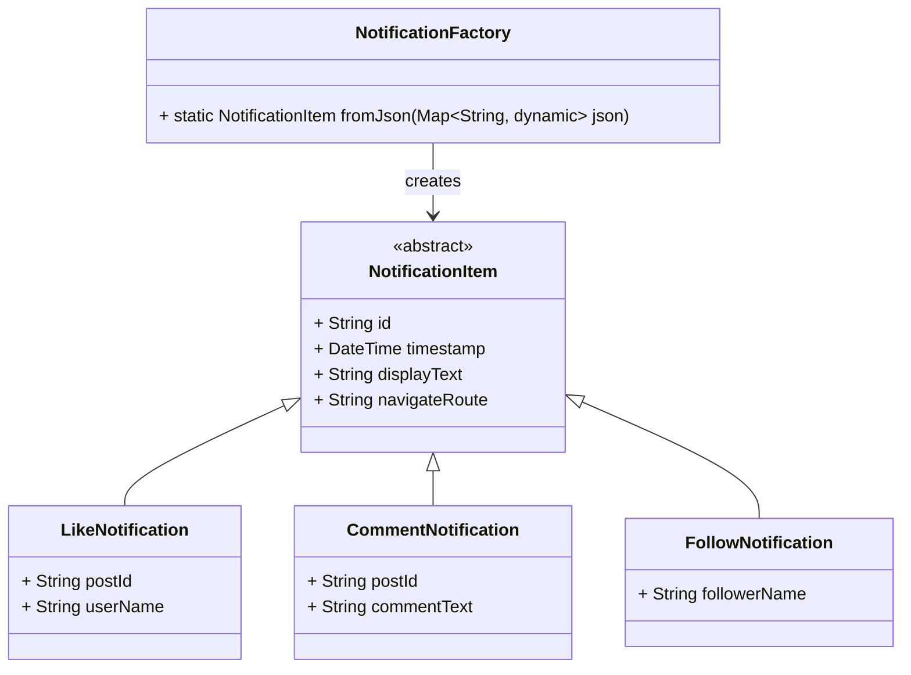

#  Inheritance 
### Powering a Scalable Notification System

---

## What You'll Learn

* How to use **inheritance** to model different types of notifications
* How to keep your code **extensible** using the **Open/Closed Principle**
* How to handle **API data** in Dart using **factory constructors**
* A real-world design pattern that's Flutter-friendly and production-ready

---

##  Why Inheritance?

Inheritance is a core pillar of Object-Oriented Programming. It lets you:

* Model shared behavior in a base class
* Define specific behavior in subclasses
* Make your system scalable and maintainable

**Example**: In a social media app, a notification system handles many types:

* Like
* Comment
* Follow
* Mention
* Tagged in a photo

These notifications are all “notifications,” but each has its own data and behavior. So we can model them using **a base class and multiple child classes**.

---

##  Real-World Challenge

You're building a social media app with a **notification screen**. Notifications come from an API that sends a list of JSON objects like:

```json
{
  "type": "like",
  "id": "n1",
  "timestamp": "2025-05-17T10:00:00Z",
  "postId": "p1",
  "userName": "Alice"
}
```

or

```json
{
  "type": "follow",
  "id": "n2",
  "timestamp": "2025-05-17T11:00:00Z",
  "followerName": "Bob"
}
```

Your app needs to:

* Decode these into Dart objects
* Show different UI for different types
* Navigate differently based on type

Instead of building this with `if`/`else` everywhere, let’s use **Inheritance + Factory Pattern**.

---

##  Class Diagram (Mermaid)



---

##  Step-by-Step Dart Code

---

### 1. Define the Base Abstract Class

```dart
abstract class NotificationItem {
  final String id;
  final DateTime timestamp;

  NotificationItem({
    required this.id,
    required this.timestamp,
  });

  String get displayText;
  String get navigateRoute;
}
```

This class:

* Is **abstract**, so you can't create `NotificationItem` directly
* Holds **shared properties** like `id` and `timestamp`
* Forces each child to define `displayText` and `navigateRoute`

---

### 2. Create Subclasses for Each Notification Type

#### LikeNotification

```dart
class LikeNotification extends NotificationItem {
  final String postId;
  final String userName;

  LikeNotification({
    required String id,
    required DateTime timestamp,
    required this.postId,
    required this.userName,
  }) : super(id: id, timestamp: timestamp);

  @override
  String get displayText => "$userName liked your post";

  @override
  String get navigateRoute => "/post/$postId";
}
```

#### CommentNotification

```dart
class CommentNotification extends NotificationItem {
  final String postId;
  final String commentText;

  CommentNotification({
    required String id,
    required DateTime timestamp,
    required this.postId,
    required this.commentText,
  }) : super(id: id, timestamp: timestamp);

  @override
  String get displayText => "New comment on your post: \"$commentText\"";

  @override
  String get navigateRoute => "/post/$postId/comments";
}
```

#### FollowNotification

```dart
class FollowNotification extends NotificationItem {
  final String followerName;

  FollowNotification({
    required String id,
    required DateTime timestamp,
    required this.followerName,
  }) : super(id: id, timestamp: timestamp);

  @override
  String get displayText => "$followerName started following you";

  @override
  String get navigateRoute => "/user/$followerName";
}
```

---

### 3. Create the Factory to Parse JSON

Instead of placing `fromJson` logic inside the base class (which breaks **Open/Closed Principle**), we create a separate factory.

```dart
class NotificationFactory {
  static NotificationItem fromJson(Map<String, dynamic> json) {
    final String type = json['type'];
    final String id = json['id'];
    final DateTime timestamp = DateTime.parse(json['timestamp']);

    switch (type) {
      case 'like':
        return LikeNotification(
          id: id,
          timestamp: timestamp,
          postId: json['postId'],
          userName: json['userName'],
        );
      case 'comment':
        return CommentNotification(
          id: id,
          timestamp: timestamp,
          postId: json['postId'],
          commentText: json['comment'],
        );
      case 'follow':
        return FollowNotification(
          id: id,
          timestamp: timestamp,
          followerName: json['followerName'],
        );
      default:
        throw UnimplementedError("Unknown notification type: $type");
    }
  }
}
```

This makes it easy to add more notification types without touching existing class logic.

---

Certainly! Here’s an **explanation-only** section focusing on **why this inheritance + factory-based notification model** is better than a traditional approach.

---

##  Why This Approach Is Better Than Traditional Methods

In a real-world app, especially something like a **social media platform**, your notification system grows fast. New types of notifications are added regularly — likes, comments, follows, tags, mentions, story views, and more.

A **traditional approach** might handle this like:

```dart
void handleNotification(Map<String, dynamic> json) {
  String type = json['type'];
  
  if (type == 'like') {
    // handle like
  } else if (type == 'comment') {
    // handle comment
  } else if (type == 'follow') {
    // handle follow
  } else {
    // unknown
  }
}
```

While this may work for 2–3 types, it **quickly becomes unmanageable**. Here's why:

---

### Problems with the Traditional Approach

| Problem                        | Description                                                           |
| ------------------------------ | --------------------------------------------------------------------- |
| Hard to scale                  | Adding a new notification means updating logic in multiple places     |
| Violates Open/Closed Principle | Every new type requires changing the same method — this leads to bugs |
| Duplicated code                | Shared properties (like ID and timestamp) are handled repeatedly      |
| Hard to test                   | Logic is often embedded in big `if-else` or `switch` blocks           |
| UI becomes messy               | Each widget has to handle all notification types separately           |

---

### Why the OOP + Factory Approach Wins

Here’s how the example we implemented solves these issues:

| Feature                                   | How It Helps                                                                 |
| ----------------------------------------- | ---------------------------------------------------------------------------- |
| **Base Class** (`NotificationItem`)       | Defines shared structure — consistent API for all notifications              |
| **Subclasses** (`LikeNotification`, etc.) | Encapsulate specific logic/data for each notification type                   |
| **Factory Class**                         | Handles type-based creation without bloating the base class                  |
| **Open/Closed Compliance**                | New types are added by creating new subclasses — no need to touch core logic |
| **UI-Friendly**                           | UI can render all types generically, with custom display/navigation per type |
| **Cleaner Codebase**                      | Easier to test, extend, and debug                                            |

---

So in short, instead of having **a mess of conditionals** scattered across your app, this approach lets you:

* Centralize creation logic in the factory
* Specialize behavior in subclasses
* Keep your main logic (like UI rendering) clean and polymorphic

This isn't just good for code quality — it's essential for **real production apps**, especially in **Flutter**, where UI needs to react flexibly to dynamic backend data.

##  Challenge Yourself

1. Add a new notification type: `mention` (user mentioned you in a post)


