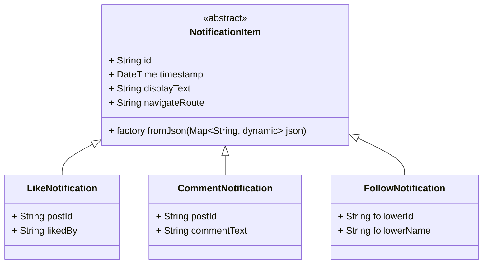

# Inheritance with Notifications in a Social Media App

## Introduction

In real-world apps like Instagram or Facebook, users receive **different types of notifications** — someone liked their post, commented on a photo, followed them, or tagged them in a story.

Although the **structure of each notification is different**, they share some common behavior:

* They all display text
* They all navigate somewhere (like to a post or a profile)
* They all have an ID and timestamp

This is a perfect scenario to use **inheritance**.

But there's more: notifications are usually received from an API as JSON objects with a `type` field. So, how can we **create the right class from the JSON**?

The answer is: **use inheritance with a factory constructor**.

---

## Learning Objectives

By the end of this section, you will:

* Understand how inheritance helps in modeling different notification types
* Use the factory constructor pattern to dynamically instantiate subclasses
* Prepare the backend model for Flutter’s UI layer to render properly

---

## Use Case

Imagine you receive this notification from the API:

```json
{
  "id": "n1",
  "type": "like",
  "postId": "p101",
  "likedBy": "user123",
  "timestamp": "2025-05-10T10:00:00Z"
}
```

Another notification might look like this:

```json
{
  "id": "n2",
  "type": "comment",
  "postId": "p202",
  "commentText": "Nice photo!",
  "timestamp": "2025-05-10T11:00:00Z"
}
```

Both are notifications, but they serve different purposes and require different UI.

---

## Step-by-Step Plan

1. Create a **base abstract class** `NotificationItem` with shared properties and behavior.
2. Create multiple **subclasses** for `LikeNotification`, `CommentNotification`, `FollowNotification`.
3. Use a **factory constructor** in `NotificationItem` to return the appropriate subclass based on the `type`.
4. The UI (Flutter) will rely on shared getters like `displayText` and `navigateRoute`.

---

## Class Diagram



---

## Dart Code: NotificationItem (Base + Factory)

```dart
abstract class NotificationItem {
  final String id;
  final DateTime timestamp;

  NotificationItem(this.id, this.timestamp);

  String get displayText;
  String get navigateRoute;

  factory NotificationItem.fromJson(Map<String, dynamic> json) {
    final type = json['type'];
    final id = json['id'];
    final timestamp = DateTime.parse(json['timestamp']);

    switch (type) {
      case 'like':
        return LikeNotification(
          id,
          timestamp,
          json['postId'],
          json['likedBy'],
        );
      case 'comment':
        return CommentNotification(
          id,
          timestamp,
          json['postId'],
          json['commentText'],
        );
      case 'follow':
        return FollowNotification(
          id,
          timestamp,
          json['followerId'],
          json['followerName'],
        );
      default:
        throw Exception('Unknown notification type: $type');
    }
  }
}
```

---

## Dart Code: Subclasses

```dart
class LikeNotification extends NotificationItem {
  final String postId;
  final String likedBy;

  LikeNotification(String id, DateTime timestamp, this.postId, this.likedBy)
      : super(id, timestamp);

  @override
  String get displayText => '$likedBy liked your post.';

  @override
  String get navigateRoute => '/post/$postId';
}

class CommentNotification extends NotificationItem {
  final String postId;
  final String commentText;

  CommentNotification(
    String id,
    DateTime timestamp,
    this.postId,
    this.commentText,
  ) : super(id, timestamp);

  @override
  String get displayText => 'New comment: "$commentText"';

  @override
  String get navigateRoute => '/post/$postId/comments';
}

class FollowNotification extends NotificationItem {
  final String followerId;
  final String followerName;

  FollowNotification(
    String id,
    DateTime timestamp,
    this.followerId,
    this.followerName,
  ) : super(id, timestamp);

  @override
  String get displayText => '$followerName started following you.';

  @override
  String get navigateRoute => '/profile/$followerId';
}
```

---

## Dart Code: Parsing from API

```dart
void main() {
  final rawJsonList = [
    {
      "id": "n1",
      "type": "like",
      "postId": "p101",
      "likedBy": "Alice",
      "timestamp": "2025-05-10T10:00:00Z"
    },
    {
      "id": "n2",
      "type": "comment",
      "postId": "p202",
      "commentText": "Nice photo!",
      "timestamp": "2025-05-10T11:00:00Z"
    },
    {
      "id": "n3",
      "type": "follow",
      "followerId": "u300",
      "followerName": "Charlie",
      "timestamp": "2025-05-10T12:00:00Z"
    }
  ];

  final notifications = rawJsonList
      .map((json) => NotificationItem.fromJson(json))
      .toList();

  for (var notification in notifications) {
    print(notification.displayText);
    print('Navigate to: ${notification.navigateRoute}');
    print('---');
  }
}
```

---

## What You Learned

* **Inheritance** allows different notification types to share structure and behavior
* The **factory pattern** helps dynamically choose the correct class at runtime
* This approach fits perfectly with how Flutter builds UIs from data
* Clean separation of concerns: the **model layer** is ready for use in the **UI layer**

---

