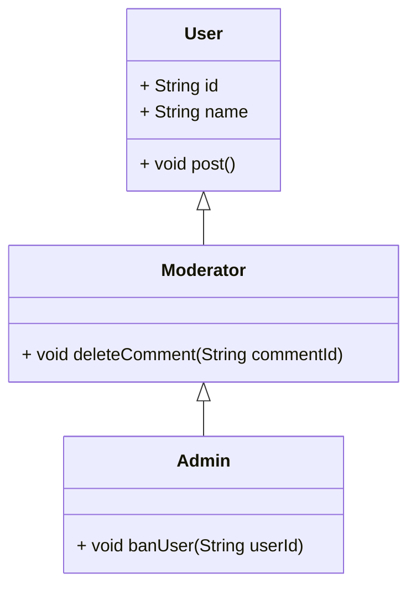

## Inheritance

### What is Inheritance?

**Inheritance** lets you create a new class based on an existing class. The new class (called a **subclass** or **child
**) inherits the properties and behavior of the **parent class**, but can also:

* Add new features
* Change existing behavior

This helps us **reuse code** and **avoid repetition**.

---

### Real-World Example: User Roles

In our app, we might have different types of users:

* A regular user (can post, like, comment)
* A moderator (can also delete comments)
* An admin (can also ban users)

Each of them shares **common properties** like `id`, `name`, `email`, but also has **extra powers** depending on their
role.

---

### Class Diagram



---

### Dart Code Example

```dart
class User {
  final String id;
  final String name;

  User(this.id, this.name);

  void post(String content) {
    print('$name posted: $content');
  }
}

class Moderator extends User {
  Moderator(String id, String name) : super(id, name);

  void deleteComment(String commentId) {
    print('$name deleted comment $commentId');
  }
}

class Admin extends Moderator {
  Admin(String id, String name) : super(id, name);

  void banUser(String userId) {
    print('$name banned user $userId');
  }
}
```

---

### Example Usage

```dart
void main() {
  var admin = Admin('a1', 'SuperAdmin');

  admin.post('Welcome to the app!');
  admin.deleteComment('c45');
  admin.banUser('u123');
}
```

---

### What You Learned

* **Inheritance** helps you reuse and extend code
* **Polymorphism** lets you write flexible code that works with many types

---

Would you like self-test problems for these two topics as well?
