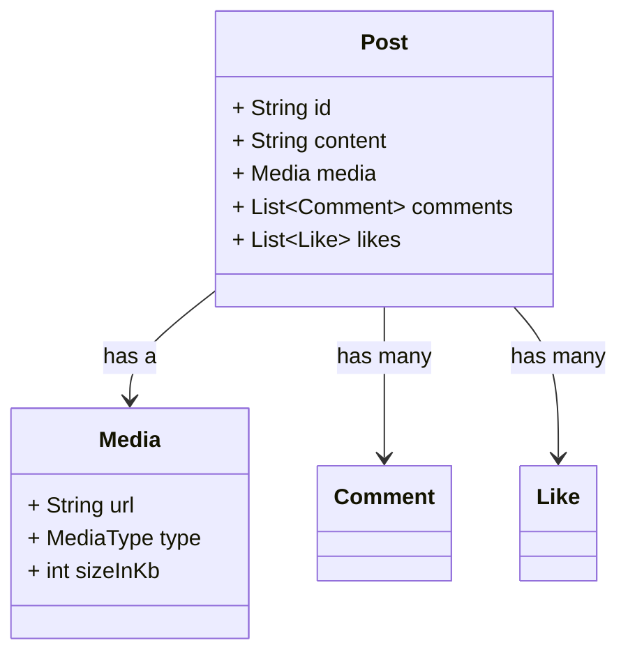

# Composition vs Inheritance in Dart (and When to Use Which)

## What’s the Difference?

| Concept     | Inheritance                                    | Composition                                     |
| ----------- | ---------------------------------------------- | ----------------------------------------------- |
| Description | "Is a" relationship                            | "Has a" relationship                            |
| Usage       | One class extends another                      | One class includes another class as a field     |
| Coupling    | Tight coupling – base class changes affect all | Loose coupling – easier to change/replace parts |
| Flexibility | Less flexible if hierarchy is too deep         | More flexible and modular                       |

---

## Example in Social Media App

Let’s take an example of **Posts** and **Media**.

### Inheritance Misuse

You might be tempted to say:

```dart
class Post extends Photo {}
```

But this would mean:

* A `Post` **is a** `Photo`
* Every `Post` is only about photos
* What if later you have video, text, or link posts?

This breaks flexibility and reusability.

---

### Use Composition Instead

Let’s define a `Media` class and let `Post` **have a** media object. This makes it future-proof.

---

## Class Diagram



---

## Dart Code: Composition in Action

```dart
enum MediaType { image, video, audio }

class Media {
  final String url;
  final MediaType type;
  final int sizeInKb;

  Media({required this.url, required this.type, required this.sizeInKb});
}

class Like {
  final String userId;
  final DateTime timestamp;

  Like(this.userId) : timestamp = DateTime.now();
}

class Comment {
  final String userId;
  final String text;
  final DateTime timestamp;

  Comment(this.userId, this.text) : timestamp = DateTime.now();
}

class Post {
  final String id;
  final String content;
  final Media media;
  final List<Like> _likes = [];
  final List<Comment> _comments = [];

  Post({required this.id, required this.content, required this.media});

  void like(String userId) => _likes.add(Like(userId));

  void comment(String userId, String text) => _comments.add(Comment(userId, text));

  List<Like> get likes => List.unmodifiable(_likes);
  List<Comment> get comments => List.unmodifiable(_comments);
}
```

---

## Why Composition Wins Here

* `Post` is not limited to only image posts
* If the backend adds a new media type (`MediaType.reel`), no need to change the post logic
* You can test or reuse the `Media` class independently
* UI becomes modular — different widgets for media and post content

---

## When to Use Inheritance

Use it only when:

* There is a **clear "is-a" relationship**
* You want to **override shared behavior** (like notification types or widgets)
* All subclasses **logically belong to the same base type**

---

## When to Use Composition

Use it when:

* A class **uses or owns** another class
* You want better **modularity** and **reusability**
* You want to **avoid deep hierarchies**

---

## Summary

| If you can say... | Use...      |
| ----------------- | ----------- |
| “X **is a** Y”    | Inheritance |
| “X **has a** Y”   | Composition |