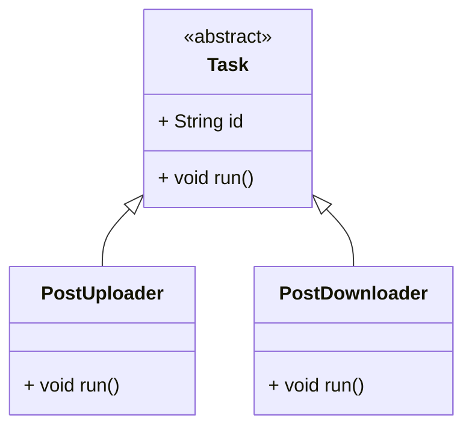

## Polymorphism

### What is Polymorphism?

**Polymorphism** means “many forms”.

It lets us write code that works with **different types of objects** as long as they follow the same interface or
abstract class. This is powerful because:

* You can **treat different classes the same way**
* You can **swap in new behaviors** without changing your code

---

### Real-World Example: Task Runner

In our app, we might have different task types: `Upload`, `Download`, `Cleanup`, etc. But we want to run them all the
same way.

If each task extends the abstract class `Task` with a `run()` method, we can call `task.run()` — **no matter which kind
it is**.

---

### Class Diagram



(Same as abstraction, but here we **focus on using them polymorphically**.)

---

### Dart Code Example

```dart
abstract class Task {
  final String id;

  Task(this.id);

  void run();
}

class PostUploader extends Task {
  final String postData;

  PostUploader({required String id, required this.postData}) : super(id);

  @override
  void run() => print('Uploading: $postData');
}

class PostDownloader extends Task {
  final String postId;

  PostDownloader({required String id, required this.postId}) : super(id);

  @override
  void run() => print('Downloading post $postId');
}
```

---

### Example Usage

```dart
void main() {
  List<Task> tasks = [
    PostUploader(id: 'u1', postData: 'Hello!'),
    PostDownloader(id: 'd1', postId: 'p001'),
  ];

  for (var task in tasks) {
    task.run(); // Same method call, different result
  }
}
```

---