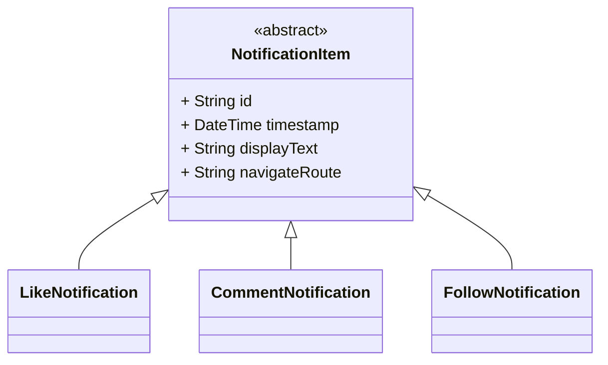

# Polymorphism in Dart (with Real App Use Case)

## What is Polymorphism?

**Polymorphism** means “many forms.” In programming, it lets us write code that works with different types of objects that share a common interface or superclass.

It allows us to:

* Treat different subclasses as the same type
* Call methods without knowing the exact class
* Write flexible and extensible code

### Simple Analogy:

If `NotificationItem` is a "general type", then `LikeNotification`, `CommentNotification`, and `FollowNotification` are "specific types".

Even if you don’t know the specific type, you can still **call shared methods** like `displayText` or `navigateRoute`.

---

## Real App Scenario: Rendering a Notification List

Let’s say your app’s notification screen receives a list of dynamic notification types. You don’t want to write separate rendering logic for each one — instead, you **loop through them polymorphically**.

This is what makes polymorphism powerful in Dart + Flutter:

* UI code becomes cleaner
* Models are easier to manage
* Adding new types later becomes simpler

---

## Class Diagram (Review from Last Section)



---

## Dart Code: Polymorphism in Action

```dart
void renderNotificationScreen(List<NotificationItem> notifications) {
  for (var notification in notifications) {
    print(notification.displayText);     // same method for all types
    print('Go to: ${notification.navigateRoute}');
    print('---');
  }
}

void main() {
  final List<NotificationItem> notificationFeed = [
    LikeNotification("n1", DateTime.now(), "p1", "Alice"),
    CommentNotification("n2", DateTime.now(), "p2", "Nice!"),
    FollowNotification("n3", DateTime.now(), "u123", "Bob")
  ];

  renderNotificationScreen(notificationFeed);
}
```

---

## Benefits of Polymorphism in Dart

| Benefit            | Description                                                                |
| ------------------ | -------------------------------------------------------------------------- |
| Code Reusability   | One function handles multiple object types                                 |
| Cleaner Flutter UI | Widgets can render all notification types using the same interface         |
| Easier to Maintain | New types (like “MentionNotification”) can be added without changing logic |
| Open for Extension | You don’t modify old code to support new behavior                          |

---

## Practice Task

Try this on your own:

* Add a new `MentionNotification` class
* Make sure it extends `NotificationItem`
* Override `displayText` and `navigateRoute`
* Add a sample JSON object with `"type": "mention"`
* Update the `factory` method to include the new type
* Add to the `main()` function and test the output

---